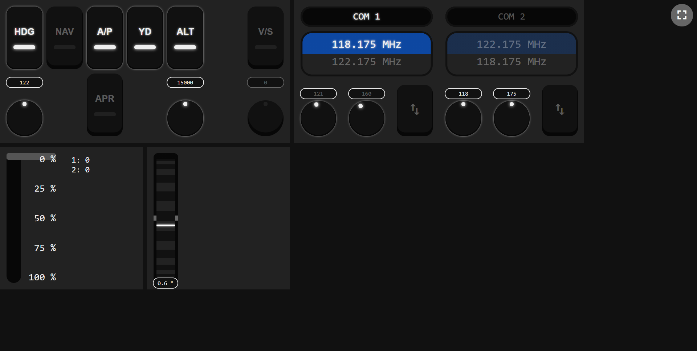

# FS Control
A small application to remotely control Flight Simulator.

It exposes an http server where you can connect using your browser (either from your computer or remotely from a mobile device or an iPad).

## Dev Tools
- Go
- Make (optional)

## Installation
You can go to the [releases](https://github.com/jagobagascon/FSControl/releases) page to download the latest FSControl binary. 

You will also need to copy the SimConnect SDK DLL to the folder where you will run FSControl. This DLL is located in `$(MSFS_SDK)\SimConnect SDK\lib`.

## Running
Executing the downloaded app will start an HTTP server in the port 8080. 

You can run it from the command line and pass the following options:
- `--address`: The address where the app will be accessed. Set this to `localhost:8080` to disable remote access to the server. Or `:<PORT>` if you just want to customize the port used.

> If the windows firewall asks for permission and you want to access the application remotely (a mobile phone or a tablet) you have to allow the application to open the port 8080. Otherwise you can deny its access and still use the app from `localhost:8080`.
