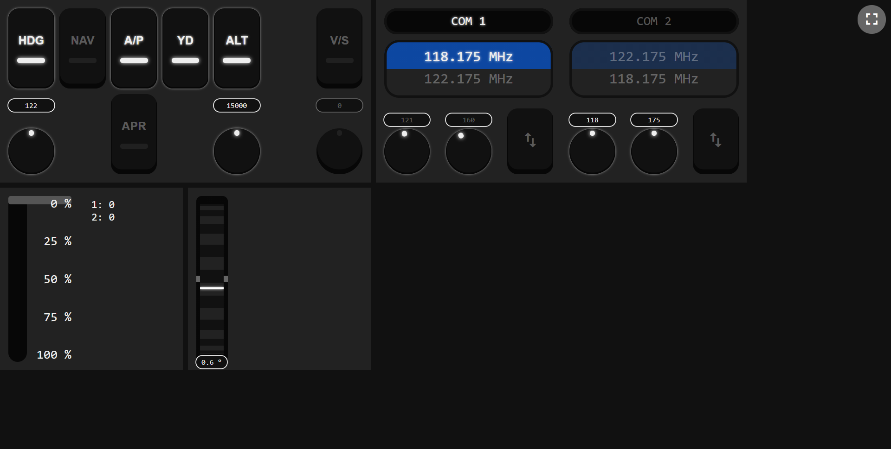

# FS Control
A small application to remotely control Flight Simulator.

It exposes an http server in the port `8080` where you can connect using your browser (either from your computer or remotely from a mobile device or an iPad).

## Dev Tools
- Go
- Make (optional)

## Setup
Right now you will have to compile this yourself. To make it run just copy the `SimConnect.dll` that can be found on your Flight Simulator folder to the root of this project and the run `go run .\cmd\fscontrol\main.go`. You have to allow the application in the windows firewall to access it from remote devices (it will ask for permission on startup).